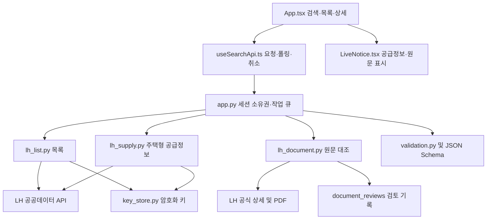

# 작성된 소스 명세서

- 문서 ID: SRC-HOUSING-001 / 버전 1.0 / 작성일 2026-09-22
- 기준 코드: `e45ec7965ad8f14c7690f718a0be282ce4e18e14` (GitHub main에 업로드한 원문 확인 기능)
- 목적: 유지보수자가 현재 구현의 파일·함수·입출력·상태·검증 위치를 찾을 수 있도록 정리한다.
- 요구사항 기준: [프로그램 명세서](PROGRAM_SPECIFICATION.md). 후속 구현은 [다음 개발 계획](NEXT_DEVELOPMENT_PLAN.md)을 따른다.

현재 구조를 설명하는 문서다. 아래 ‘향후’ 또는 ‘미구현’ 항목은 실행 가능한 기능으로 보지 않는다. 비밀키 값·세션 토큰은 문서에 포함하지 않는다.

## 1. 구성 및 경계

앱은 LH 승인키를 보유하지 않는다. 서버가 목록·공급정보 API에만 키를 사용한다. 원문 HTML/PDF는 별도의 공개 요청이다. 검색·공급·원문 결과는 서버 메모리에 있고 데이터베이스는 아직 없다. 앱 세션은 계정 로그인이 아닌 임시 작업 소유권 수단이다.

## 2. 프론트엔드 파일 명세

| 파일 | 주요 구성 | 입력·출력 및 역할 |
|---|---|---|
| [index.ts](../frontend/index.ts) | 앱 등록 진입점 | Expo에서 App 실행 |
| [App.tsx](../frontend/App.tsx) | App, 검색·뒤로 가기, 화면 상태 | 검색/결과/상세 전환, 선택 공고, 확인 필요·제외·확인 완료 탭, 예시 모드와 실제 모드 분리 |
| [search.ts](../frontend/search.ts) | 서울 입력 정규화 및 예시 자료 | 서울 별칭 처리, 지원하지 않는 구 입력 안내. 서버 수집기는 아님 |
| [useSearchApi.ts](../frontend/useSearchApi.ts) | useSearchApi, validNotice, validSupply, validDocument | 세션 토큰·작업 ID·revision·세대 번호 관리, 서버 호출·형식 검증·폴링·취소 |
| [LiveNotice.tsx](../frontend/LiveNotice.tsx) | ScopeSummary, NoticeCard, NoticeDetail, SupplyPanel, DocumentPanel, LiveButton | 수집 범위, 목록·상세, 공급정보 및 원문 항목 표시, 안전한 공식 링크, 조회 상태 알림 |
| [app.json](../frontend/app.json) | Expo 설정 | 앱 실행 설정 |
| [package.json](../frontend/package.json) / [pnpm-lock.yaml](../frontend/pnpm-lock.yaml) | 실행 명령·의존성 | 실제 설치 버전의 기준 |

### useSearchApi 반환 인터페이스

| 항목 | 입력 / 반환 | 동작 |
|---|---|---|
| start | 없음 / Promise | 새 검색 시작, 이전 작업 정리, 결과 상태 갱신 |
| cancel | 없음 / Promise | 활성 검색의 서버 취소 요청 및 상태 반영 |
| stop | 없음 / void | 화면 이탈 시 세대 번호 변경, 이전 결과 무효화, 필요 시 서버 취소 요청 |
| loadSupply | noticeId, AbortSignal / Promise<SupplyResult> | POST 후 researching 동안 GET 폴링 |
| loadDocument | noticeId, AbortSignal / Promise<DocumentResult> | 원문 POST 후 researching 동안 GET 폴링 |
| status, busy, job | 상태값 | 진행 안내, 조작 가능 여부, 현재 검색 결과 |

웹 서버 주소는 EXPO_PUBLIC_API_URL 또는 http://127.0.0.1:8000이다. 네이티브는 서버 주소 설정이 필요하다. 검색 폴링은 750ms, 개별 요청 제한은 10초, 검색 루프의 경과 검사 기준은 60초다. 공급정보 폴링은 400ms/25초, 원문은 400ms/35초다. 검색 작업 ID나 세대 번호가 바뀌면 늦은 응답을 사용하지 않는다.

### 화면 표시 원칙

- 공급정보의 unknown 값은 0원으로 표시하지 않는다. 면적은 최대 소수점 8자리까지 표시한다.
- DocumentPanel은 PDF와 사전 검토 기록의 일치 결과를 별도 영역에 표시한다. 공급정보 API에서 미확인인 값 자체를 덮어쓰지 않는다.
- 항목 값은 텍스트로 렌더링하며 원격 HTML이나 스크립트를 실행하지 않는다.
- iOS 상태 안내는 접근성 알림 대기열, Android/웹은 polite live region을 사용한다. 실제 모바일 낭독 검사는 아직 필요하다.
- 상세에서 돌아가면 호출한 카드로 초점을 복귀한다. 조회 결과 도착으로 초점을 강제로 옮기지 않는다.

## 3. 백엔드 파일 명세

| 파일 | 주요 함수·클래스 | 처리 계약 |
|---|---|---|
| [app.py](../backend/app.py) | Search, create_app, app | FastAPI 라우트, 요청 검증, 작업 생성, 소유권, 워커 및 메모리 상태 |
| [serve_lh.py](../backend/serve_lh.py) | main | --start/--end 게시일 범위 검증, 키 확인, 실제 목록·공급·원문 기능 활성화, 서버 시작 |
| [key_store.py](../backend/key_store.py) | save_key, load_key, resolve_key, main | Windows DPAPI 파일 저장·읽기, 상태 CLI, 환경변수 우선순위 |
| [lh_list.py](../backend/lh_list.py) | fetch_page, collect_list, to_notice, official_url | 페이지 수집·요청 조건 대조·공고 정규화·마감/취소 분리 |
| [lh_response.py](../backend/lh_response.py) | normalize_row, safe_official_url | 공개 응답 필드, 공고 식별자와 공식 URL 일치, 키 반사 차단 |
| [lh_supply.py](../backend/lh_supply.py) | parameters, numeric_fact, parse_supply, fetch_supply | 지원 레이아웃 요청, 숫자·단위 검증, 주택형·근거 생성 |
| [lh_document.py](../backend/lh_document.py) | Node, Tree, read_page, apply_review, fetch_document | 상세 HTML 식별, 공고문 PDF 선택, 해시·정정 관계와 검토 기록 대조 |
| [lh_probe.py](../backend/lh_probe.py) | 요청 구성·키 정규화·NoRedirect·접속 점검 | API 요청 규격, bounded read 공통값, 리다이렉트 거부 |
| [lh_errors.py](../backend/lh_errors.py) | mapped_error, payload_error, decode_response | 알려진 JSON/XML 오류 코드만 반환, 원격 오류 본문·인증정보 비전파 |
| [lh_adapter.py](../backend/lh_adapter.py) | collect | 기존 접속 점검 경로. 실제 목록 모드와 구분 |
| [validation.py](../backend/validation.py) | validate_result, validate_supply, validate_document | JSON Schema 및 상태·근거·소유 검색 연결의 의미 검증 |
| [reference_rules.py](../backend/contracts/reference_rules.py) | 참조 판정 함수 | 접수 경계·미확인·정정 상태 등 오프라인 참조. 실제 원문 검증기 아님 |

### create_app 내부 저장 및 동시성

- jobs: 검색 ID → 소유자 해시와 검색 결과.
- keys: 소유자 해시 + Idempotency-Key → 검색 ID.
- supplies / documents: 검색 ID + 공고 ID → 하위 결과.
- RLock으로 공유 상태를 보호하고 ThreadPoolExecutor 2개 워커와 BoundedSemaphore 8개 슬롯을 공유한다.
- 검색 작업 1,000개까지 저장하며 자동 만료가 없다. 서버 재시작 시 모든 작업이 사라진다. 운영 배포 전에 정리 정책이 필요하다.
- collector, executor, supplier, documenter 주입 인자로 테스트의 외부 호출과 작업 실행 순서를 제어한다.

### 목록 수집

`collect_list(region, is_cancelled, fetcher, max_pages, clock)`는 error/retryable, checked_at, collection, notices, excluded_notices를 포함한 결과를 반환한다. 오류 위치에 따라 일부 필드는 없을 수 있다.

fetch_page는 저장키로 게시일 시작·종료, 지역, 상위유형 06, 페이지를 요청한다. dsSch의 조건 반영, 실제 반환 날짜, 행 형식·총건수를 확인한다. 20행씩 최대 5페이지, 조사 경과 기준 35초, 개별 요청 최대 10초, 응답 1MiB 상한이다. 페이지 중복·총건수 변경·중도 실패는 전체 완료로 취급하지 않는다.

to_notice는 목록 상태의 마감·취소를 제외 목록으로 분리한다. 원문 검증 전이므로 모집 중 후보도 needs_review이며 현재 버전 관계는 확정하지 않는다.

### 공급정보

`parameters`는 목록의 식별자에서 요청값을 만든다. 유형 061/062/063 + 상위유형 06 + 연결시스템 03만 지원한다. `parse_supply`는 dsSch의 공고·유형과 성공 헤더, dsList01 및 dsList01Nm를 대조한다.

`numeric_fact`는 명시된 단위·숫자 형식·안전한 수치 범위를 확인한다. ‘공고문 참조’, 단위 불명, 잘못된 숫자는 unknown/null/사유로 반환한다. 공급면적 표제에 단위가 없으면 ㎡로 추정하지 않는다. 최대 100개 주택형을 허용한다.

### 원문 항목 확인

1. 목록에서 확인한 현대식 LH 상세 URL과 공고 ID·제목을 검증한다. 현재 원문 수집기는 legacy URL을 지원하지 않는다.
2. HTML의 공고문 그룹에서 PDF 한 개를 찾는다. 공개 JavaScript 리터럴에서 panId/currPanId/sOtxtPanId를 읽되 코드는 실행하지 않는다.
3. HTML 1MiB, PDF 10MiB 제한으로 가져오고 PDF 서명을 확인한다. 리다이렉트를 따라가지 않는다.
4. [검토 기록](../backend/document_reviews/2015122300020605.json)의 공고 ID·SHA-256·원공고 ID·현재 ID·정정 사유와 비교한다.
5. 모두 일치할 때 facts와 warnings를 복사한다. 다른 파일·미등록 문서는 facts 없이 재검토 안내를 반환한다.

현재 한 PDF의 17항목만 검토되어 있다. 서버는 PDF 텍스트를 매번 자동 추출하거나 자격을 추론하지 않는다. 텍스트 추출·표 렌더링 검토는 개발 과정에서 별도로 수행했다. reviewed=true는 해당 항목들의 검토 기록 일치이며 공고 전체 verified와 다르다.

## 4. 내부 API 명세

각 보호된 요청은 X-Session-Token을 사용한다. 토큰 길이는 32~128자이고 서버는 SHA-256으로 소유자를 비교한다. 새 검색 POST에만 1~128자의 Idempotency-Key가 필수다.

| 메서드 | 경로 | 요청 | 정상 반환 |
|---|---|---|---|
| GET | /health | 없음 | 200, 모드·목록 연결 설정·처리 한도 |
| POST | /v1/search-jobs | region JSON + 두 헤더 | 202, 검색 작업 |
| GET | /v1/search-jobs/{id} | 세션 | 200, 현재 작업 |
| POST | /v1/search-jobs/{id}/cancel | 세션 | 200, 취소 또는 기존 종료 결과 |
| POST | /v1/search-jobs/{id}/notices/{notice_id}/supply | 세션 | 202, 공급 작업 또는 기존 결과 |
| GET | 위 경로 | 세션 | 200, 공급 결과 |
| POST | /v1/search-jobs/{id}/notices/{notice_id}/document | 세션 | 202, 원문 작업 또는 기존 결과 |
| GET | 위 경로 | 세션 | 200, 원문 결과 |

- 401: 세션 토큰 누락·길이 불충족.
- 404: 작업/공고 없음, 타 소유자 접근, 하위 결과 미요청.
- 409: 동일 중복방지 키로 다른 지역 요청, 하위 조회 시 부모가 partial/completed가 아님.
- 422: 요청 형식 또는 지역 오류.
- 503: 작업·슬롯 상한, 워커 실행 실패.
- 외부 LH 오류는 결과의 status/error_code로도 전달한다. 내부 HTTP 200/202만으로 실제 자료 성공을 판단하지 않는다.

동일 검색·공고의 하위 POST는 완료·실패 결과도 재사용한다. 현재 하위 작업의 개별 취소 API는 없다. 앱 이탈은 클라이언트 대기를 중단하지만 진행 중인 외부 요청이 즉시 종료된다는 보장은 없다.

## 5. 데이터 계약

권위 있는 기계 명세는 [search-result.schema.json](../shared/contracts/search-result.schema.json)의 `$defs`다. 아래 표는 유지보수용 요약이다.

| 객체 | 주요 필드 | 주의점 |
|---|---|---|
| job | id, revision, status, region, sources, collection, notices, excluded_notices | 현재 실제 목록 성공은 partial. 미연결 기관도 표시 |
| notice | official_id, listing, recruitment_status, verification_status, checked_in_job_id | 다른 검색의 공고 혼입 금지. 모집·검증 상태 분리 |
| fact | state, value, unit, reason, evidence_ids | unknown은 null+사유. known은 값+근거 |
| supply_result | job_id, notice_id, status, units, evidence, versions | available/empty/failed 구분. unknown 가격을 0으로 변환 금지 |
| document_result | job_id, notice_id, status, reviewed, facts, warnings, pdf_url, sha256, current_id, original_id | partial에서만 확인 항목 반환. 파일·공고 provenance 필요 |
| document fact | category, label, value, page | 읽기용 설명. 금액·시간의 정규화된 기계 판정 필드가 아님 |
| evidence/version | URL, 위치, 확인 시점, 버전 ID·관계 | 키 없는 출처 URL. 미확인 버전 관계는 unclassified |

검색 상태 계약은 queued/researching/verifying/completed/partial/failed/cancelled다. 현재 실제 조사 경로는 원문 전체 검증기가 없어 verifying/completed를 정상 성공 경로로 생성하지 않는다. validate_result는 현재 verified 공고를 거부한다. 이를 제거하는 것만으로 검증 기능이 완성되지 않는다.

## 6. 설정과 보안

| 설정 | 역할 |
|---|---|
| LH_ENABLE_LIST | 1이면 실제 목록 경로 |
| LH_ENABLE_SUPPLY | 기본 공급 어댑터의 실제 조회 허용 |
| LH_ENABLE_DOCUMENT | 기본 원문 어댑터의 실제 조회 허용 |
| LH_ENABLE_PROBE | 기존 접속 점검 기능 설정 |
| LH_POSTED_DATE / LH_CLOSING_DATE | 변수명과 달리 현재 목록에서는 게시일 조회 시작/종료 |
| LH_SERVICE_KEY | 별도로 설정되어 있으면 DPAPI 파일보다 우선 |
| EXPO_PUBLIC_API_URL | 앱의 서버 주소. 승인키를 넣는 설정이 아님 |

키 저장 위치는 프로젝트의 `.secrets/lh-service-key.dpapi`다. 같은 Windows 사용자 범위에서 복호화하며 공유·배포 대상에서 제외한다. resolve_key를 사용하는 목록·공급 요청과 달리 원문 요청은 키를 읽지 않는다. 현재 CORS는 로컬 개발·QA origin만 허용한다. 공개 배포용 로그인·영구 저장·HTTPS 배포 설정은 미구현이다.

## 7. 테스트 및 변경 영향

| 변경 대상 | 우선 검사 파일·명령 | 확인할 실패 사례 |
|---|---|---|
| app.py·작업 큐 | test_api.py, test_workers.py, test_lh_supply.py, test_lh_document.py | 소유권·중복·상한·취소·워커 예외 |
| 목록·응답 | test_lh_list.py, test_lh_guide.py, test_lh_envelope.py | 조건 미반영·페이지 변경·잘못된 행·마감 제외 |
| 공급정보 | test_lh_supply.py | 단위 누락·공고문 참조·공고 불일치·잘못된 숫자 |
| 원문·검토 기록 | test_lh_document.py | 해시/관계 변경 시 값 보류, PDF 위장·크기·URL 제한 |
| 키 저장 | test_key_store.py | 암호화 왕복·변조·환경 우선순위·비노출 |
| 참조 판정 | backend/contracts/test_reference_rules.py | 접수 경계·취소·정정·미확인 |
| 앱 상태·UI | tsc, Expo export, frontend/qa.mjs | 오래된 응답·초점·조건별 금액·좁은 화면·오류 |
| 실제 웹 연결 | frontend/qa-live-list.mjs | 실제 목록·원문 연계. 외부 요청 발생 |

최근 실행 기록은 서버 131개·참조 규칙 26개 통과, 웹 자동 접근성 41개 상태 위반 0건, 동작 확인 22개 통과다. [원문 검증 기록](validation/2026-09-22_DOCUMENT_INTEGRATION.md)을 근거로 하며 이번 문서 작성 중 재실행한 수치는 아니다. 모바일 실기 검사는 미실행이다.

## 8. 알려진 유지보수 제약

- 현재 HTML 구조와 JavaScript 변수명에 의존한다. 사이트가 바뀌면 기존 값을 유지하지 않고 실패 또는 검토 필요로 처리한다.
- 단일 PDF만 선택한다. HWPX 전용·복수 공고문·스캔 문서의 자동 처리는 없다.
- 검토 기록은 항목 설명 문자열이다. 대상별 금액·전환 조건·접수 회차·자격 조건의 정규화 모델 확장이 필요하다.
- API 공급 사실과 원문 사실을 병합해 확인 완료로 승격하는 경로는 없다.
- 세션·작업·키 저장은 로컬 개발 중심이다. 데이터 만료, 저장소, 계정 권한, 운영 배포를 별도로 설계해야 한다.
- 모든 화면 변경은 접근성 정책과 기존 QA를 따른다. 사용자 모바일 실기 확인을 웹 자동검사로 대체하지 않는다.
